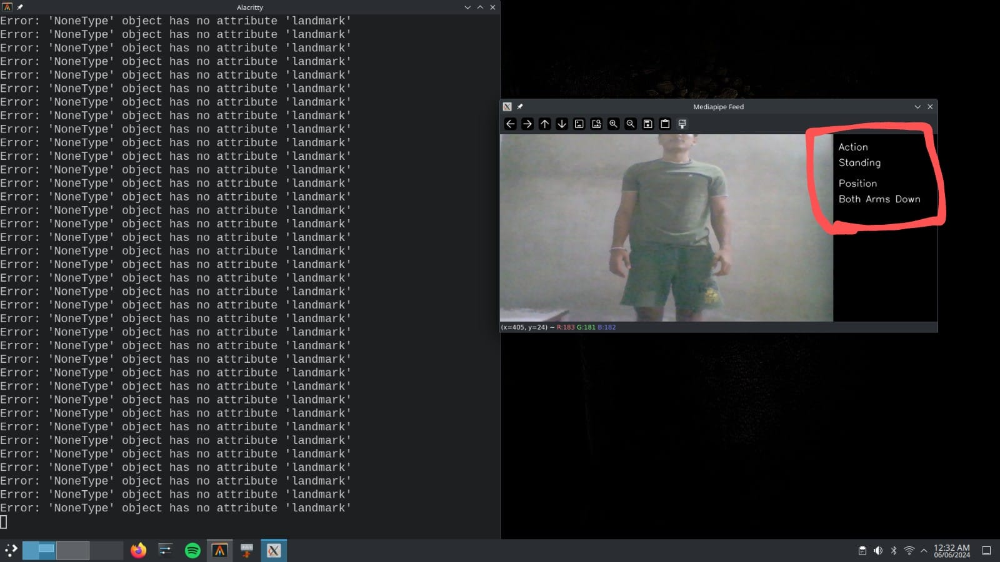

# Action Identification

This project demonstrates the identification of human actions and positions using the Mediapipe library for pose detection. The main code captures video input, processes the pose landmarks, calculates angles between joints, and identifies specific actions and positions based on these angles.

## Prerequisites

Make sure you have the following libraries installed:
- `cv2` (OpenCV)
- `mediapipe`
- `numpy`

## Files

- `Action Identification.py`: Main code file that performs action identification.
- `action.png`: Image indicating that the action is "standing" with the position "both arms are down".

## Image

### Action Image

This image indicates that the action is "standing" with the position "both arms are down".

## Functions

- **calculate_angle(a, b, c)**: Calculates the 2D angle between three points.
- **calculate_angle_3d(a, b, c)**: Calculates the 3D angle between three points.
- **main loop**: Captures video input, processes pose landmarks, calculates angles, and identifies actions and positions.

## Main Execution Flow

1. The script captures video input from the webcam.
2. It processes the frames to detect human pose landmarks.
3. It calculates angles between various joints.
4. Based on these angles, it identifies the action (e.g., standing, sitting) and the position (e.g., both arms down, left arm up).
5. The identified action and position are displayed on the video feed.

## Acknowledgments

- The project uses the Mediapipe library for pose detection and angle calculations.
- Thanks to the authors of the `cv2`, `mediapipe`, and `numpy` libraries for making such powerful tools available.

Feel free to contribute to this project by submitting issues or pull requests. Enjoy exploring action identification using pose detection!

